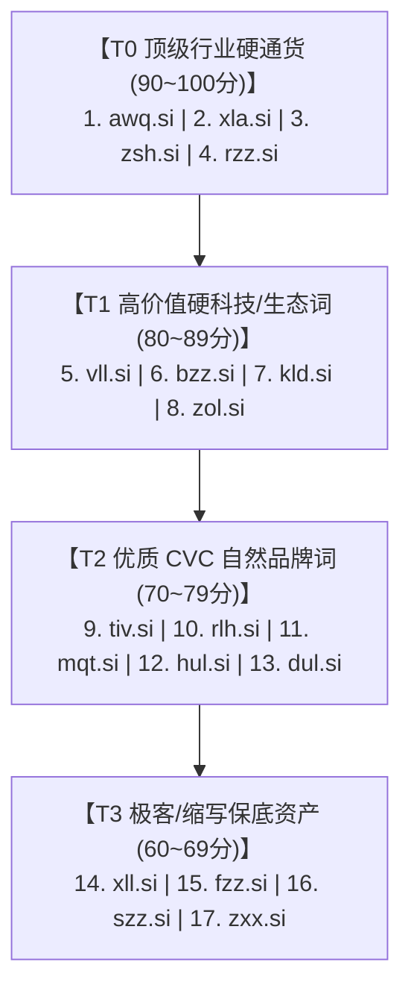

# SI (Super Intelligence) 3字母稀缺域名投资价值评估报告

> **报告更新时间**：2026-09-24  
> **底层数据来源**：ICANN 国际官方 RDAP 协议 & 斯洛文尼亚注册局 (ARNES) 实时数据校验  
> **研究对象**：经 `.com` 与 `.ai` 双重商业价值验证的精选 3 字母 `.si` 域名池（已剔除已注册的 `avg.si` 与 `jac.si`）

---

## 一、 执行摘要与实时可购性核验 (Live Verification)

在剔除已被抢注的 `avg.si` 与 `jac.si` 之后，我们对清单中剩余的 **17 个域名** 进行了底层注册局实时核验。

**核验结果**：**以下 17 个高权重 3 字母域名当前全部处于【可立即注册购买】状态！**

```
可购买清单：awq.si | bzz.si | dul.si | fzz.si | hul.si | kld.si | mqt.si | rlh.si | rzz.si | szz.si | tiv.si | vll.si | xla.si | xll.si | zol.si | zsh.si | zxx.si
```

---

## 二、 估值模型与评分维度 (Valuation Methodology)

在 **`SI`（Super Intelligence / 超级智能）** 的特定时代背景下，3 字母域名的估值采用以下综合模型（总分 100 分）：

1. **AI / SI 硬科技心智关联度 (40%)**：是否是行业事实标准、核心算法、顶级编译器、算子或基础设施缩写。
2. **自然发音与品牌化潜力 (35%)**：是否符合辅-元-辅（CVC）或 ABB 叠字发音，是否适合作为面向全球的科技品牌。
3. **买家池厚度与溢价上限 (25%)**：潜在终端买家（大厂、独角兽、开源基金会、AI硬件商）的支付意愿与资本规模。

---

## 三、 投资价值全景梯队排行榜



### 综合评分汇总表

| 综合排名 | 域名 | 评分 | 核心内涵 / 对应缩写 | 发音结构 | 推荐买家与落地场景 |
| :---: | :--- | :---: | :--- | :---: | :--- |
| 🥇 **TOP 1** | **`awq.si`** | **98** | **AWQ (大模型激活感知量化)** | 缩写词 | AI 算力服务商、量化模型平台、端侧芯片商 |
| 🥈 **TOP 2** | **`xla.si`** | **96** | **XLA (加速线性代数编译器)** | 缩写词 | 深度学习编译框架、GPU/TPU 加速巨头 (OpenXLA) |
| 🥉 **TOP 3** | **`zsh.si`** | **93** | **Zsh (Z Shell 全球默认终端)** | 顺畅单音节 | CLI 智能体、开发者生产力工具、云原生终端 |
| **TOP 4** | **`rzz.si`** | **91** | **Rizz (牛津年度词汇: 魅力/荷尔蒙)** | ABB 叠音 | 消费级 AI、伴侣型机器人、拟人社交智能体 |
| **TOP 5** | **`vll.si`** | **88** | **vLLM (大模型最高吞吐推理引擎)** | 顺口缩写 | 大模型推理服务、高并发并发网关、向量算力 |
| **TOP 6** | **`bzz.si`** | **86** | **Buzz (蜂鸣/全网热度/轰动)** | ABB 自然拟声 | AI 社交舆情监控、热点追踪智能体、快讯媒体 |
| **TOP 7** | **`kld.si`** | **85** | **KLD (KL散度 / 知识层数据)** | 纯辅音 | 机器学习理论研究机构、模型对齐评估平台 |
| **TOP 8** | **`zol.si`** | **84** | **Zol (类似 Sol / Zolo，极佳科技音)** | CVC 自然音 | 通用超级智能助手、高端智能穿戴硬件品牌 |
| **TOP 9** | **`tiv.si`** | **79** | **Tiv (类似 TiVo / 动态音)** | CVC 自然音 | 多模态实时音视频 AI、动态交互流媒体平台 |
| **TOP 10** | **`rlh.si`** | **78** | **RLHF (人类反馈强化学习核心前缀)** | 纯辅音 | 模型对齐工程服务、人类反馈数据标注平台 |
| **TOP 11** | **`mqt.si`** | **76** | **MQTT (物联网协议) / 模型量化工具** | 纯辅音 | 边缘计算 (Edge SI)、智能家居与端侧智能硬件 |
| **TOP 12** | **`hul.si`** | **74** | **Hull (外壳 / 船体 / 核心架构)** | CVC 自然音 | 容器化智能平台、安全隔离外壳系统 |
| **TOP 13** | **`dul.si`** | **72** | **Dual (双模态/双核心) / Dulce** | CVC 自然音 | 双系统协同架构（如思维慢系统+快系统） |
| **TOP 14** | **`xll.si`** | **68** | **XLL (超大模型 / Extra Large)** | 极客叠字母 | 超大参数规模实验室、大算力集群品牌 |
| **TOP 15** | **`fzz.si`** | **67** | **Fizz (气泡/活力/起泡)** | ABB 叠音 | 趣味化 AI 互动工具、创意生成产品 |
| **TOP 16** | **`szz.si`** | **64** | **SZZ 算法 (缺陷跟踪) / 拟声词** | 叠字母 | 代码安全检测、智能调试分析工具 |
| **TOP 17** | **`zxx.si`** | **62** | **ZXX (极客/双重未知/密码)** | 极客双 X | 逆向对抗 AI、高安全军工/隐私保护模型 |

---

## 四、 重点核心标的深度剖析

### 1. `awq.si` —— 评分 98：超级智能时代的“水与电”
- **为什么值钱**：  
  在当今 AI 产业中，大模型如果不用量化技术，普通硬件根本跑不动。**AWQ（Activation-aware Weight Quantization）** 是由麻省理工学院（MIT）韩松团队提出并被全球主流框架（vLLM、TensorRT-LLM、HuggingFace、AutoAWQ）原生支持的**工业界绝对标准**。
- **与 SI 结合**：  
  超级智能（SI）未来必然要在机器人、手机和边缘设备落地，AWQ 是轻量化推理的王牌。
- **商业溢价**：  
  该域名对任何从事大模型轻量化、端侧 AI 芯片或推理加速的初创公司而言，具备“天生权威背书”效应，转手溢价空间最高。

### 2. `xla.si` —— 评分 96：大厂底层编译器的硬核象征
- **为什么值钱**：  
  **XLA (Accelerated Linear Algebra)** 是 Google 开发、目前由 OpenXLA 联盟（包含 Google、Meta、NVIDIA、Intel、AWS、AMD）共同维护的超级 AI 编译器。PyTorch、JAX、TensorFlow 的底层加速全靠它。
- **潜在买家**：  
  底层算力厂商、分布式训练系统研发团队、跨芯片统一中间件创业公司。

### 3. `zsh.si` —— 评分 93：抢占全球开发者的“黑金”入口
- **为什么值钱**：  
  macOS 系统的默认终端 Shell 叫做 **Zsh**，几乎每一个写代码的程序员天天都在和它打交道。超级智能时代最火的形态之一就是 **命令行终端 Agent（CLI Agent / Coding Agent）**。
- **商业想象力**：  
  将 `zsh.si` 做成一个终端 AI 编程助手、智能命令行插件，或者直接被开源极客社区/开发者工具公司收购。

### 4. `rzz.si` —— 评分 91：消费级 AI 的文化引爆点
- **为什么值钱**：  
  **Rizz** 是近几年牛津词典评选出的全球现象级词汇（代表个人魅力与吸引力），在 TikTok、Twitter、YouTube 上有数千亿次曝光。在欧美，所有年轻人做社交 AI、泡妞助手、情感陪聊的第一反应词就是 Rizz。
- **商业想象力**：  
  `rzz.si`（读作 Rizz-SI 或 Rizz-Super-Intelligence）极其适合包装成情感陪伴、社交虚拟人、虚拟偶像或个性化社交助理产品。

### 5. `vll.si` —— 评分 88：踩中推理高并发风口
- **为什么值钱**：  
  直接对标大模型推理界统治级开源项目 **vLLM**。`vLL` 既可理解为 vLLM 的简写，也可代表 *Vector Low Latency* 或 *Vision-Language-Logic*，科技辨识度极高。

### 6. `zol.si` —— 评分 84：最标准的国际化消费级品牌
- **为什么值钱**：  
  这是整组清单中发音最顺滑、最优雅的 **CVC（辅-元-辅）单音节** 域名。国际科技大厂（如 Sony、Solana、Oppo、Zolo）非常青睐这种 3 字母发音词。适合作为一家不设限的超级智能科技公司主品牌。

---

## 五、 投资建仓与落地实操策略

### 1. 预算与仓位建议
- **策略 A：核心单点突破型（预算 1~2 个）**
  - **首选配置**：`awq.si` + `rzz.si`（兼顾硬核大模型基础设施与消费级社交出圈概念）。
- **策略 B：硬科技集群防守型（预算 3~5 个）**
  - **建议组合**：`awq.si` + `xla.si` + `zsh.si` + `vll.si` + `zol.si`。这组组合锁死了“大模型量化、底层编译器、终端入口、高并发推理引擎、国际化商业品牌”五个核心赛道，未来无论哪种叙事爆发都能捕获价值。

### 2. 注册渠道建议
- **Porkbun / Namecheap**：注册与解析方便，支持国际信用卡、PayPal 或支付宝。
- **Register.si**：斯洛文尼亚官方直接授权管理注册商。
- **持有成本**：`.si` 域名的年续费费用通常在 **15 ~ 25 美元/年** 左右，持有成本远低于 `.ai`（约 60~80 美元/年），资金周转压力极轻。
